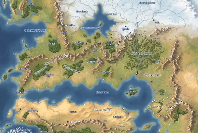
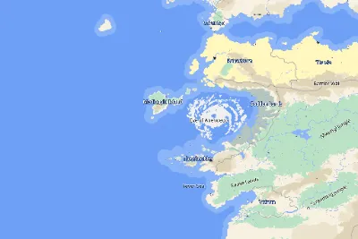
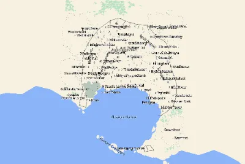
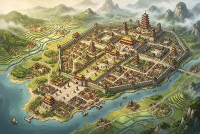
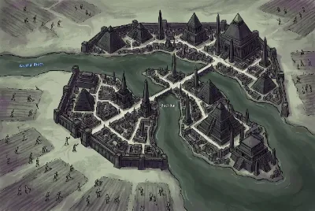
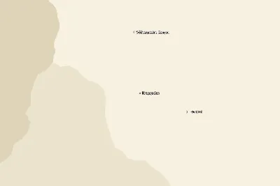
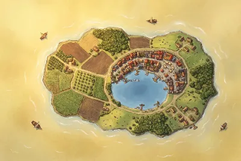
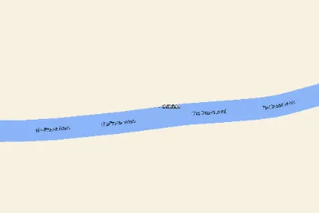
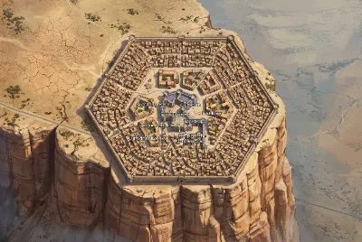

# Golarion Maps for Foundry VTT

A complete set of **297 painted map scenes of Golarion** for Foundry Virtual
Tabletop — the world map, continents, the Inner Sea meta-regions, nations,
city regions, full city maps, and more than two hundred individual towns and
settlements, each rendered as illustrated fantasy-atlas art in a consistent
painterly style.

Every scene ships ready to play:

- **Hexploration-ready grids** — 50-mile hexes on meta-region maps, 10-mile
  hexes on nation and city-region maps, gridless city and town maps; ruler
  distances are correct in miles everywhere.
- **Location pins** — settlements and points of interest are pinned on every
  map. Double-click a pin to open its gazetteer journal page, which links out
  to the full PathfinderWiki article.
- **Gazetteer journals** — one journal per map, organized in the same
  geographic folder tree as the scenes (each region folder holds its region
  map, city-region maps, and town maps).
- **Culture-true art** — Tian Xia cities use East-Asian architecture, dwarven
  holds are forge-lit mountain gates, Qadiran cities are Keleshite desert
  architecture, Irrisen is locked in eternal winter, Geb is black basalt and
  bone, the Shackles are storm-lashed tropics, and so on.

Geography follows the
[PathfinderWiki mapping project](https://github.com/pf-wikis/mapping)
([map.pathfinderwiki.com](https://map.pathfinderwiki.com)) — coastlines,
rivers, roads, and settlement positions on the painted maps match the
community's canonical map of Golarion. This module would be nothing without
their work, which builds on GIS data by John Mechalas and interactive map work
by Oznogon.

## Examples

| | | |
|:---:|:---:|:---:|
| [](assets/scenes/inner-sea-region.webp) | [](assets/scenes/high-seas.webp) | [](assets/scenes/absalom-city.webp) |
| The Inner Sea Region | High Seas — the Eye of Abendego | Absalom city map |
| [](assets/scenes/danjing-town.webp) | [](assets/scenes/mechitar-town.webp) | [](assets/scenes/kraggodan-town.webp) |
| Danjing (Lingshen, Tian Xia) | Mechitar (undead Geb) | Kraggodan (dwarven Sky Citadel) |
| [](assets/scenes/shiman-sekh-town.webp) | [](assets/scenes/chillblight-town.webp) | [](assets/scenes/kaer-maga-city.webp) |
| Shiman-Sekh (Golden Oasis, Osirion) | Chillblight (cold fey, Irrisen) | Kaer Maga atop the Storval Rise |

## Installation

In Foundry: **Install Module** and paste the manifest URL:

```
https://github.com/gmtoolkit/foundryvtt-golarion-maps/releases/latest/download/module.json
```

Then, in a world with the module enabled, open
**Settings → Configure Settings → Golarion Maps → Import All Maps** to import
every scene and journal in one pass (imports are chunked and take about a
minute). Re-running the import after an update upgrades your existing scenes
in place — document ids are stable across releases.

You can also browse the **Golarion Maps** scene compendium and import
individual scenes instead.

## Not using Foundry? Just want the map images?

Download
**[maps_stand_alone.zip](https://github.com/gmtoolkit/foundryvtt-golarion-maps/releases/latest/download/maps_stand_alone.zip)**
(always the latest release) — all 297 painted maps as label-free images (no
text, pins, or grids baked in), ready for any VTT, image viewer, or printer.
See the README inside the archive for terms (same Community Use Policy as
the module).

## Licensing

- **Code** is licensed under the [MIT License](LICENSE).
- **Map content** uses trademarks and/or copyrights owned by Paizo Inc., used
  under [Paizo's Community Use Policy](https://paizo.com/licenses/communityuse).
  We are expressly prohibited from charging you to use or access this content.
  This module is not published, endorsed, or specifically approved by Paizo.
  For more information about Paizo Inc. and Paizo products, visit
  [paizo.com](https://paizo.com).
- Map geography follows the community
  [pf-wikis/mapping](https://github.com/pf-wikis/mapping) project, which
  operates under the same Community Use Policy.

## Development

```sh
npm install
npm run build     # vite lib build -> dist/
npm run packs     # compile packs-src/ scene docs -> packs/ (LevelDB)
npm run deploy    # build + packs + copy into local Foundry data
```

Releases are automated: every push to `main` builds the module, bumps the
semver patch version (include `#minor` or `#major` in the commit message to
bump those instead), and publishes a GitHub release carrying `module.json`
and `module.zip`. See `.github/workflows/release.yml`.

The map-generation pipeline (vector bakes, style generation, art generation,
label compositing) is development tooling and is not part of the shipped
module surface; see `DECISIONS.md` for its history and design notes.
